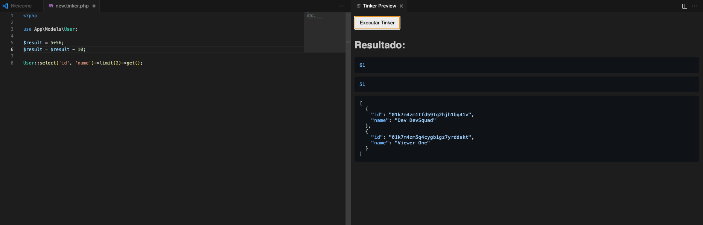

# Tinker Bon

Execute código PHP no Tinker/Laravel diretamente do VS Code, com preview instantâneo e integração total!

---

## Features

- Crie arquivos PHP para Tinker com um clique (`Tinker Bon: New Tinker File`)
- Execute qualquer trecho de código PHP/Laravel no Tinker sem sair do VS Code (`Tinker Bon: Run Code in Tinker`)
- Preview do resultado ao lado do editor, com destaque de sintaxe
- Suporte a múltiplas expressões, variáveis e comandos Laravel
- Saída formatada em JSON para fácil leitura

Exemplo de preview:

## Requirements

- Projeto Laravel com autoload configurado (`composer install`)
- PHP instalado na máquina
- Dependências do wrapper já inclusas (PsySH, Symfony Console)

## Extension Settings

Esta extensão não adiciona configurações customizadas no momento. Basta abrir um projeto Laravel e usar os comandos!

## Known Issues

- Apenas projetos Laravel são suportados
- O preview pode não funcionar em arquivos fora do workspace

## Release Notes

### 0.0.1
- Primeira versão: criação de arquivos, execução de código, preview instantâneo

---

## Working with Markdown

Você pode editar este README usando o Visual Studio Code. Aqui estão alguns atalhos úteis:

- Dividir o editor (`Cmd+\` no macOS ou `Ctrl+\` no Windows/Linux)
- Alternar preview (`Shift+Cmd+V` no macOS ou `Shift+Ctrl+V` no Windows/Linux)
- Pressione `Ctrl+Space` para ver snippets de Markdown

## For more information

- [Documentação do VS Code para Markdown](http://code.visualstudio.com/docs/languages/markdown)
- [Referência de sintaxe Markdown](https://help.github.com/articles/markdown-basics/)

---

## 💡 Contribua

Sugestões, bugs ou ideias? Abra uma issue ou envie um PR!

## 📚 Licença
MIT
